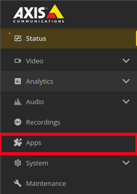
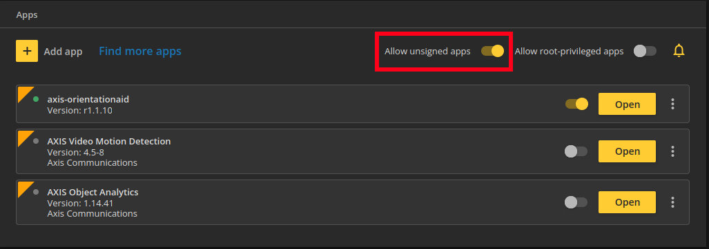
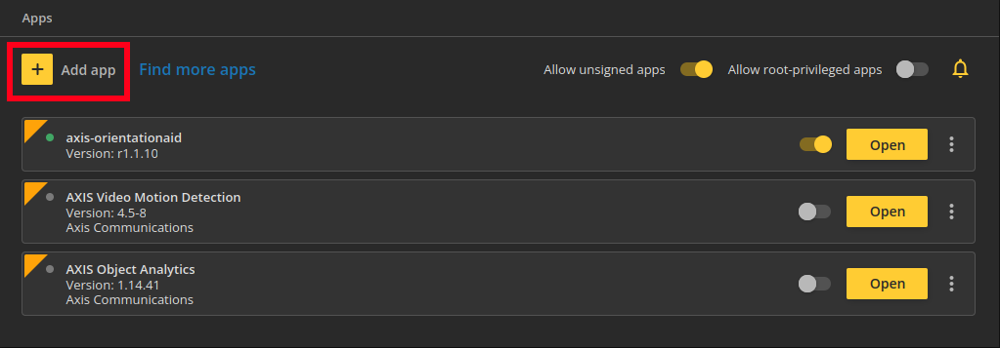
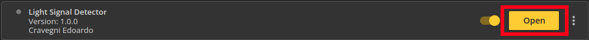
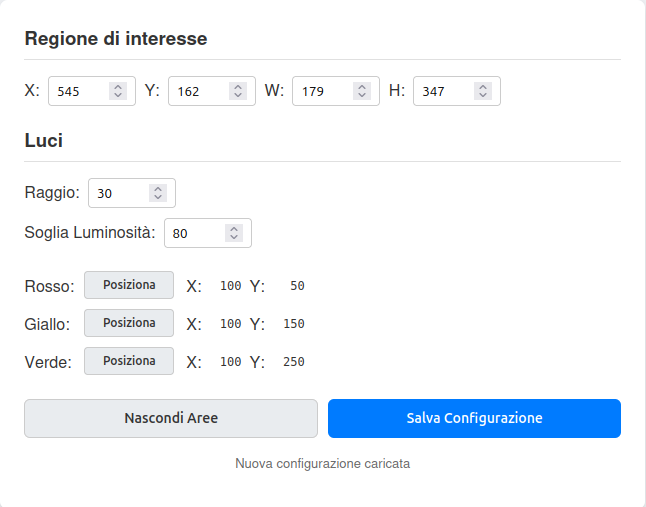

# Rilevamento dello Stato di un Segnale Luminoso in Tempo Reale con Smart Camera (ACAP)

Questa repository contiene il progetto di tirocinio di Cravegni Edoardo, studente di Ingegneria Informatica all’ Università degli Studi di Firenze, realizzato durante il tirocinio curriculare svolto presso Magenta Srl.

## Contenuto della repository (struttura dei file)

```sh
redpl-acap
├── app
│ ├── imgprovider.cpp - Implementazione del wrapper per la cattura dei frame video dall'SDK di AXIS
│ ├── imgprovider.h - File di intestazione per il modulo di acquisizione video
│ ├── json.hpp - Libreria di terze parti per la gestione dei dati JSON
│ ├── LICENSE
│ ├── main.cpp - File sorgente principale che esegue la logica di rilevamento e il server web
│ ├── Makefile - Specifica come deve essere compilato l'ACAP
│ └── manifest.json - Specifica le opzioni relative all'esecuzione per l'ACAP
├── html
│ ├── index.html - Pagina HTML principale che contiene la struttura dell'interfaccia e la logica JavaScript
│ ├── style.css - Foglio di stile CSS per la formattazione e l'aspetto grafico dell'interfaccia web
├── Dockerfile - File di istruzioni per Docker che definisce l'ambiente di cross-compilazione
└── README.md
```

## Predisposizione dell'ambiente di sviluppo

Il progetto è stato sviluppato per la piattaforma ACAP (AXIS Camera Application Platform) e utilizza un ambiente di build basato su Docker per la cross-compilazione del codice. L'applicazione è stata sviluppata e testata su una telecamera della serie AXIS M10 Box Camera. È tuttavia compatibile con la maggior parte dei dispositivi AXIS che supportano la piattaforma ACAP. Per gli sviluppatori che non dispongono di un dispositivo fisico, AXIS mette a disposizione il [Virtual Loan Tool (VLT)](https://www.axis.com/partner_pages/adp_virtual_loan_tool/common#/home), un servizio che permette di noleggiare e accedere a telecamere reali da remoto. 

Sebbene sul sito ufficiale di AXIS sia presente una guida completa, i passaggi essenziali per l'installazione dei prerequisiti e la compilazione del pacchetto finale sono riportati di seguito.

### Requisiti Software

Git è un sistema di controllo di versione necessario per scaricare il codice sorgente.

Per utenti Windows o macOS: scaricare l'installer dal [sito ufficiale di Git](https://git-scm.com/downloads).

Per utenti Linux (Debian/Ubuntu): eseguire i seguenti comandi sul terminale. 

```sh
sudo apt update
sudo apt install git
```

Docker è la piattaforma che useremo per creare l'ambiente di compilazione. È fondamentale seguire la guida ufficiale per installare Docker Engine (per Linux) o Docker Desktop (per Windows/macOS).

Per utenti Windows/macOS: [Install Docker Desktop on Windows](https://docs.docker.com/desktop/setup/install/windows-install/)

Per utenti Linux: [Install Docker Engine on Ubuntu](https://docs.docker.com/engine/install/ubuntu/)

Nota per utenti Linux: Dopo l'installazione, è fortemente consigliato seguire i [passaggi post-installazione](https://docs.docker.com/engine/install/linux-postinstall/) per usare Docker senza sudo.

## Compilazione ed Installazione dell'applicazione

Dopo essersi posizionati nella cartella principale del progetto eseguire il comando di build. Scegliere il comando corretto in base all'architettura del proprio dispositivo AXIS.

Per architettura armv7hf:

```sh
docker build --tag <APP_IMAGE> .
```
    
Per architettura aarch64:

```sh
docker build --tag <APP_IMAGE> --build-arg ARCH=aarch64 .
```

<APP_IMAGE> è il nome con cui verrà etichettata l'immagine Docker.

L'istruzione seguente copia il risultato dall'immagine del container in una cartella locale chiamata build:

```sh
docker cp $(docker create <APP_IMAGE>):/opt/app ./build
```

Al termine dell'istruzione, sarà presente una nuova cartella "build", all'interno della quale si troverà il file .eap che costituisce l'applicazione. Per poterla installare sulla telecamera sarà necessario seguire i seguenti passaggi:

1. Reperire l'indirizzo IP del proprio dispositivo. Ecco i metodi più comuni per trovarlo:
       
- Il modo più semplice per gli utenti Windows è scaricare e installare lo strumento gratuito [AXIS IP Utility](https://www.axis.com/support/tools/axis-ip-utility) dal sito ufficiale di AXIS. Una volta avviato, il programma rileverà automaticamente tutte le telecamere AXIS presenti sulla rete e mostrerà i loro indirizzi IP.

- Per gli utenti Linux, un metodo efficace per trovare la telecamera è utilizzare nmap, un potente strumento di scansione di rete.  Se non si ha nmap sul proprio sistema, è possibile installarlo facilmente da terminale attraverso i seguenti comandi:

```sh
sudo apt update
sudo apt install nmap
```

Una volta completata l'installazione, puoi lanciare una scansione per trovare i dispositivi sulla rete che rispondono sulla porta RTSP (554) e tentare di scoprirne l'URL dello stream. Esegui il seguente comando, adattando la sottorete se necessario:

```sh
nmap --script rtsp-url-brute -p 554 192.168.1.0/24
```

L'output del comando elencherà gli indirizzi IP dei dispositivi che hanno risposto alla scansione; tra questi ci sarà quello della telecamera.

Per i dispositivi noleggiati tramite il servizio VLT, l'indirizzo IP viene fornito direttamente da AXIS al momento del noleggio.


2. Accedere all'interfaccia web della telecamera.

3. Andare alla sezione "Apps" 


    
4. Assicurasi che l'opzione "Allow unsigned apps" (Consenti app prive di firma) sia attiva. Questo è necessario per installare applicazioni in fase di sviluppo.



5. Cliccare su "Add app" e caricare il file Light_Signal_Detector_1_0_0_armv7hf.eap (Light_Signal_Detector_1_0_0_aarch64.eap in caso si abbia un dispostivo con architettura aarch64) prensente all'interno della cartella "build".



## Funzionamento dell'Applicazione


### Configurazione

Una volta che l'applicazione è installata e in esecuzione sulla telecamera, è necessario configurarla:

1. Nell'elenco delle applicazioni installate, trova "Traffic Light Detector" e clicca sul bottone "Open" per avviare la pagina di configurazione.



2. Clicca e trascina il mouse sul video per disegnare un rettangolo blu che includa l'intero segnale luminoso che vuoi monitorare.

3. Posiziona le Luci: Per ogni colore (Rosso, Giallo, Verde), clicca sul rispettivo bottone "Posiziona" e successivamente clicca sul video, all'interno della ROI, nel punto esatto in cui si trova la luce corrispondente. Le coordinate verranno popolate automaticamente.

4. Salva la Configurazione: Clicca sul bottone "Salva Configurazione". Le impostazioni verranno inviate al backend C++ e l'applicazione inizierà il processo di rilevamento.

Questa è l'interfaccia utente per la configurazione:

    

### Utilizzo

Una volta salvata la configurazione, lo stato del segnale rilevato in tempo reale verrà mostrato tramite l'indicatore circolare colorato in alto a sinistra nel flusso video.

Per un'analisi più dettagliata o per scopi di debug, è possibile monitorare i log testuali generati dall'applicazione. Si può accedere ai log in due modi:

- Dall'interfaccia web della telecamera: selezionando l'applicazione e apri la scheda "Log".
- Da terminale (in tempo reale): connettendosi alla telecamera via SSH ed eseguendo il seguente comando per visualizzare un flusso continuo dei log:
    
```sh
journalctl -f
```

I log iniziali confermano il corretto avvio dell'applicazione e mostrano i parametri con cui viene inizializzato lo stream video:

```sh
tld[8878]: Avvio dello stream a risoluzione fissa: 1280x720
tld[8878]: Server GIO in ascolto su localhost:8080
tld[8878]: Dump of vdo stream settings map =====
tld[8878]: 'buffer.strategy': <uint32 3>
tld[8878]: 'channel'--------: <uint32 1>
tld[8878]: 'format'---------: <uint32 3>
tld[8878]: 'height'---------: <uint32 720>
tld[8878]: 'width'----------: <uint32 1280>
```
Una volta salvata una configurazione valida tramite l'interfaccia web, l'applicazione inizia l'analisi. I log mostrano in tempo reale l'output dell'algoritmo di rilevamento:

```sh
tld[8878]: Richiesta gestita dal thread: POST /local/tld/api/save_config HTTP/1.1
tld[8878]: Luminosita R:45.1, Y:30.2, G:188.7 con soglia 80 -> Stato = GREEN
tld[8878]: Luminosita R:192.5, Y:40.6, G:48.2 con soglia 80 -> Stato = RED
```

## Dettagli Tecnici e Implementativi

Questa sezione fornisce un'analisi più approfondita del processo di build e della logica interna dell'applicazione.

### Processo di Build

Il Dockerfile definisce un processo di build automatizzato che gestisce tutte le dipendenze:

- Preparazione Ambiente: Vengono installate le librerie di sistema necessarie, come libglib2.0-dev, che fornisce le funzioni GIO per il server web.

- Compilazione Dipendenze Esterne: Le librerie OpenCV vengono compilate da sorgente, ottimizzate per l'architettura ARM della telecamera.

- Compilazione Applicazione: Infine, viene compilata l'applicazione principale. Il Makefile si occupa di collegare (linking) il codice C++ sia alle librerie di sistema (GIO) sia a quelle esterne (OpenCV).

### Gestione delle Dipendenze a Runtime

Per assicurare che l'applicazione, una volta installata sulla telecamera, trovi le librerie OpenCV che abbiamo compilato, il Makefile utilizza l'opzione del linker -rpath,'$$ORIGIN/lib'. Questa istruzione dice all'eseguibile di cercare le librerie necessarie (.so) in una sottocartella chiamata lib rispetto alla propria posizione.

### Logica dell'Applicazione 

Il codice sorgente principale (main.cpp) gestisce l'intera logica dell'applicazione in modo multi-thread:

- Configurazione: Utilizza la libreria header-only json.hpp per leggere e scrivere i parametri di configurazione (come le coordinate della ROI) da un file config.json.

- Acquisizione Video: Usa le API VDO dell'SDK per catturare i frame dalla telecamera.

- Analisi Immagine: Applica un algoritmo di computer vision (OpenCV) basato sulla luminosità per determinare lo stato del segnale luminoso.

- Web Server: Gestisce un'interfaccia web di configurazione e uno stream video MJPEG tramite un server HTTP basato su GIO.
